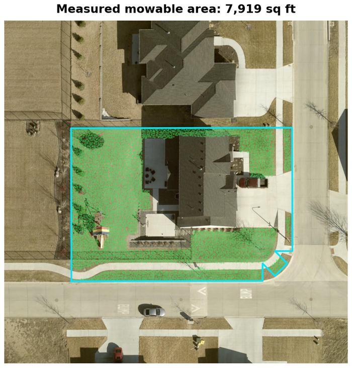
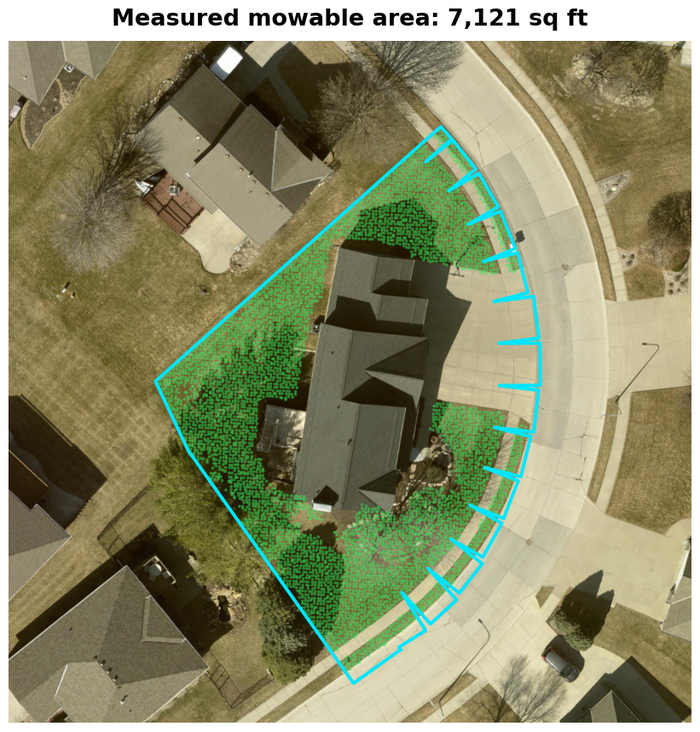

# TurfIQ

**The exact mowable area of any lawn — from just an address.** A square-footage measurement backed by 3D ground data, with a picture your crew and your customer can both verify.

Built for the lawn-care industry: given an address, it measures the turf a crew would actually mow — including the strip out to the curb — even where trees, shadows, or driveways would fool a naive estimate.

### ▶︎ [Try the live demo](https://sergioreyesmle.github.io/turfiq/) &nbsp;·&nbsp; real measurements, explore them in your browser

---

## See it

Each green point is real ground the system measured as lawn. There are no ground returns on a roof or a driveway, so the house and pavement exclude themselves — and the outline is the lot extended to the curb.

---

## How it works

Three data layers, combined — so canopy, shadow, and hardscape don't throw the number off:

1. **Find the property.** The address resolves to the authoritative parcel boundary — the legal lot lines, not an approximation.
2. **Read the ground cover.** Current aerial imagery is analyzed to separate turf from house, driveway, and paving.
3. **Measure with 3D ground data.** LiDAR ground returns confirm genuinely mowable turf — even under tree canopy — and set the square footage. The right-of-way strip out to the curb is included, because that's what actually gets mowed.

The result is a defensible square footage plus a picture the customer and the crew can both check.

## Why it's accurate

- **Authoritative boundaries**, not inferred lot lines.
- **Two independent sensors** cover each other's blind spots — imagery can't see lawn under trees; 3D ground data can.
- **The area is measured from ground points**, so roofs and paving are excluded by nature.
- **Fails clearly** when it can't be sure, rather than returning a confident wrong number.

## Built like production software

Not a notebook — a deployed, tested, continuously integrated service:

- **Ports-and-adapters architecture** — new regions and data sources plug in without touching the core.
- **CI/CD** — every change is linted and tested, then continuously deployed to a live hosted API.
- **A byte-identical regression gate** guards every change to the measurement math.
- **A fast, fully offline test suite** and reproducible, fully pinned builds.

---

*Demo shows pre-computed results for sample properties on public-domain county aerial imagery. © All rights reserved.*
